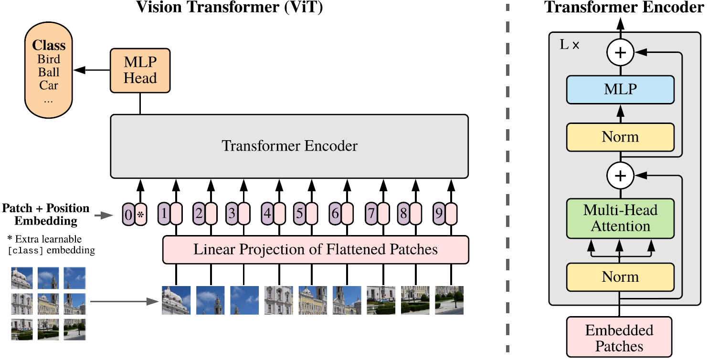
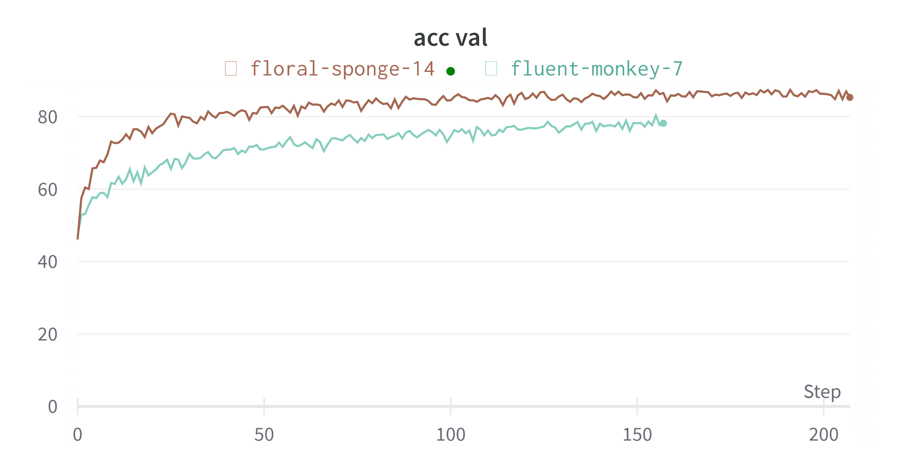

## Vision Transformer - Explanation and Implementation

</img>

This repo explains how the Vision Transformer (ViT) works, and how to implement and train a ViT from scratch in PyTorch.

The dataset that is used is **ImageNet1k** but only 10 classes are used so that the model can be trained on a single GPU in a reasonable time.

## Table of Contents
* [How does the ViT work](#how-does-the-vit-work)
    * [Transformer Encoder](#transformer-encoder)
* [Regularization and data augmentation](#regularization-and-data-augmentation)
* [Result](#result)

## How does the ViT work? 
Convolutional neural networks (CNN) dominated the field of computer vision in the years 2012-2020. But in 2020 the paper [An Image is Worth 16x16 Words](https://arxiv.org/abs/2010.11929) showed that ViT could attain state-of-the-art (SOTA) results with less computational cost.

The architecture of the ViT is shown in Figure 1. 
A 2D image is split into several patches e.g., 9 2D patches. Each patch is flattened and mapped with a linear projection. 
The output of this mapping is concatenated with an extra learnable class [cls] embedding. The state of the [cls] embedding is randomly initialized, but it will accumulate information from the other tokens in the transformer and is used as the transformer's output.

Unlike a CNN, a ViT has no inherent way to retrieve position from its input. Therefore a positional embedding is introduced. It could be concatenated with all embedded patches, but that comes with a computational cost, therefore the positional embedding is added to the embedded patches, which empirically gives good results [(Dosovitskiy et al., 2020)](https://arxiv.org/abs/2010.11929).
After the positional encoding is added the embedded patches is fed into the **Transformer encoder**.

 

Figure 1: Model overview [1](https://arxiv.org/abs/2010.11929).

### Transformer Encoder
The ViT uses the encoder introduced in the famous [Attention Is All You Need](https://arxiv.org/abs/1706.03762?context=cs) paper, see Figure 1.
The encoder consists of two blocks, a multiheaded self-attention, and a multilayer perceptron. Before each block, a [layernorm](https://arxiv.org/abs/1607.06450) is applied and each block is surrounded by a [residual connection](https://arxiv.org/abs/1512.03385). A residual connection is not needed in theory, but empirically it is found to make a big difference. The residual connection can help the network to learn a desired mapping $H(x)$ by instead letting the network fit another mapping $F(x) := H(x) - x$ and then add $x$ to $F(x)$ to get the desired $H(x)$. 

The self-attention used here is a simple function of three matrices $Q, K, V$ (queries, keys, and values)

$$
\begin{equation}
\text{Attention}(Q,K,V)=\text{softmax}(\frac{QK^{\top}}{\sqrt{d_k}})V,
\end{equation}
$$

where the scaling factor $d_k$ is the dimension of the queries and keys.

Instead of performing a single attention function with $d_{\text{model}}$-dimensional queries, keys, and values, it is found to be beneficial to linearly project all of them $h$ times with different learned linear projections to $d_k$, $d_k$, and $d_v$ dimensions respectively

$$
\begin{equation}
 \text{MultiHead}(Q,K,V)=\text{Concat}(\text{head}_1,...,\text{head}_h)W^O,
\end{equation}
$$

where

$$
\begin{equation}
 \text{head}_i=\text{Attention}(QW^Q_i,KW^K_i,VW^V_i),
\end{equation}
$$

where the projections are parameter matrices 

$$
W_i^Q\in\mathbf{R}^{d_{\text{model}}\times d_k},\
W_i^K\in\mathbf{R}^{d_{\text{model}}\times d_k},\ W_i^V\in\mathbf{R}^{d_{\text{model}}\times d_V},\ W^O\in\mathbf{R}^{hd_v\times d_{\text{model}}},
$$

and $h$ is the number of heads.

## Regularization and data augmentation
To regularize the model, [dropout](https://jmlr.org/papers/volume15/srivastava14a/srivastava14a.pdf) and [stochastic depth regularization technique](https://arxiv.org/abs/1603.09382?context=cs) is used. The latter is a training procedure that enables the seemingly contradictory setup to train short networks and use deep networks at test time. This is accomplished by randomly dropping a subset of layers and bypassing them with the identity function during training.

For data augmentation, two quite recent techniques is used, namely [Mixup](https://arxiv.org/abs/1710.09412) and [RandAugment](https://arxiv.org/abs/1909.13719). Mixup constructs virtual training examples 

$$
\begin{align}
\widetilde{x} =\ & \lambda x_i + (1-\lambda)x_j, \ \text{where $x_i, x_j$ are raw input vectors},\\
\widetilde{y} =\ & \lambda y_i + (1-\lambda)y_j, \ \text{where $y_i, y_j$ are one-hot label encodings},
\end{align}
$$

$(x_i,\ y_i)$ and $(x_j,\ y_j)$ are two examples drawn randomly from the training data, and $\lambda \in [0,1]$. Therefore, the mixup extends the training distribution by incorporating the prior knowledge that linear interpolations of feature vectors should lead to linear interpolations of the associated targets.

RandAugment transforms the training data with the following transformations: rotate, shear-x, shear-y, translate-y, translate-x, auto-contrast, sharpness, and identity. Which transformations that are used and the magnitude of each transformation are randomly selected.

#TODO add example figure
## Result
#TODO add actual result

Preliminary results...

 

## Acknowledgements
Aside from the papers cited in the text, I found the following resourses useful

* [pytorch-original-transformer](https://github.com/gordicaleksa/pytorch-original-transformer) - Aleksa Gordić
* [Illustrated Transformer](http://jalammar.github.io/illustrated-transformer/) - Jay Alammar
* [vit-pytorch](https://github.com/lucidrains/vit-pytorch/blob/main/vit_pytorch/vit.py) - Phil Wang

## Licence

